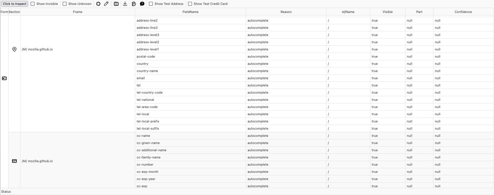

# Autofill Devtools

This addon provides some tools to assist developers with autofilling.

# Features

- Display detected field information.
- Support temporary creation of credit card and address records for testing.
- Support capturing screenshots of the inspected results.
- Support downloading the page for offline investigation.
- Support adding and editing field type tags as data tags for machine learning.
- Support pre-filling information on Bugzilla to file Autofill site compatibility issues.
- Support generating a Firefox mochitest to verify field detection results.

# Using the addon

Once installed, you should see an "Autofill" panel in the Developer Tools
